***

# Project Overview

Over lockdown as a family with a 4 year old daughter, we played endless memory games and puzzles. My daughter has a long standing passion/obsession for Paw Patrol so it seems fitting to build her a Paw Patrol Memory game to keep for entertained.

## View my project in git hub <a href="https://github.com/ccarabine/memory-game/"> Git Hub Project </a>

## View the live site here<a href="https://ccarabine.github.io/memory-game/"> Paw Patrol memory game </a>

Responsive image 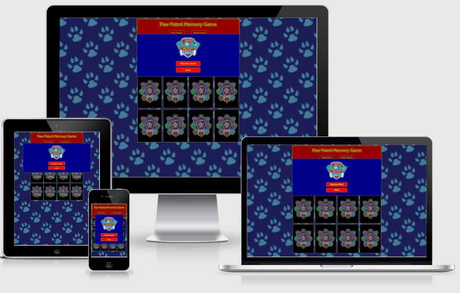

Image from  <a href="http://ami.responsivedesign.is/">Am I Responsive</a>, to display the websites home page across mobile, tablet and desktop.

***
# Table of Contents 

1. [User Experience (UX)](#ux)
    * [Strategy](#strategy)  
    * [Scope](#scope)
    * [Structure](#Structure)
    * [Skeleton](#skeleton)
    * [Surface](#design)
      
2. [Features](#features)
    * [Current Features](#features-current)
    * [Features to implement](#features-toimplement)

3. [Testing](#testing)

    * [Features testing](#features-testing)
    * [User Stories Testing](#user-stories-testing)
    * [Constructive User Feedback](#user-feedback)
    * [Known issues during testing](#known-issue)
    * [Validation Testing -HTML ](#validation-testing-html)
    * [Validation Testing -CSS ](#validation-testing-css)
    * [Validation Testing -A11y Color Contrast Accessibility](#validation-testing-A11y)
    * [JSHint-Validation-Service](#jshint-validation-service)
    * [Chrome Dev Tools Lighthouse](#Lighthouse)
    * [Design Responsiveness Testing](#testing-responsiveness)
    * [Bugs left](#unfixed-bugs)
4. [Deployment](#deployment)
5. [Technologies Used](#technology-used)
6. [Credits](#credits)

7. [Acknowledgements](#acknowledgements)

---
# User Experience (UX)  
Project Goals 

The main goal for this game is to provide a fun challenge to the user via a memory game. The site will test the user’s memory across 12 cards to choose 2 matching cards/pairs at a time. The user will also be able to receive an end score based on how many moves they made, with the opportunity to replay the game to try and beat their score.

The main target audience for this website are children between the ages of 4-7 years old with an interest in Paw Patrol, although the game will resonate with all children unfamiliar with the brand.

---
# Strategy 

The website has been created for users to enjoy a fun Paw Patrol memory game.

## User Stories: 

### Site Owner Goals 

* I want to provide a fun game for children online users between the ages of 4 - 7 years old
* I want users to navigate through the game with ease and for the game to be intuitive
* I want users to be incentivised to return and replay the game to beat their previous scores listed on the scoreboard
* I want users to have facility to return and replay the game with different games each time.
* I want the game to be accessible to all users

### Site User Goals:
* As a user, I want to play an online game
* As a user who has never played the game before, I need to locate the rules and understand how to play the game
* As a user, I need to know how the scoring works
* As a user, I want to know when I have match two cards
* As a user, I want to know when I have finished the game and see my score
* As a user, I want to be able to restart the game at any point
* As a user of multiple devices, I need a website that is fully responsive, invoking the same user experience across all devices, in particular my mobile. 
* As a user, I want to know how many matched cards and moves I have made during the game at any time
* As a user, I want to be challenged with different games each time I play
* As a user, I expect the site to be fully accessible 

### [Contents table ](#home)
---
# Scope 

## Strategy Trade-offs
I have rated the features on a scale of 1 to 5 in terms of importance (how important is it for the project now) and viability (how realistic is that we can implement a solution)

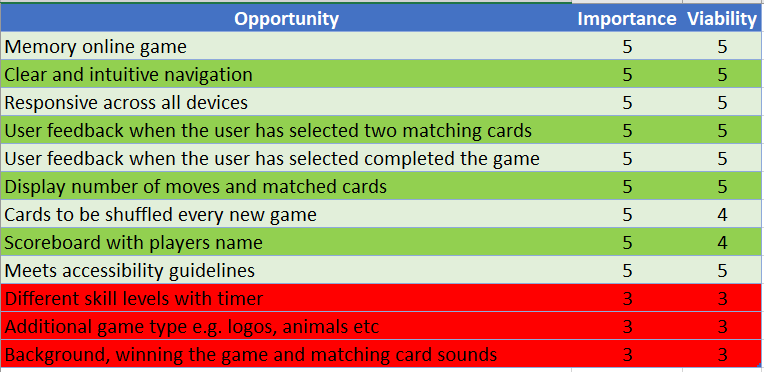

To achieve the strategy goals, the following features highlighted in dark/light green will be implemented to create a minimal viable  product due to timescale and technical ability. The additional features in red will be added at a further stage

### [Contents table ](#home)
---
# 3. Structure  

As the target user is aged between 4-7 years, it is important for the structural design of this game to be simple, relevant, accessible and appealing to the age group.  This is mainly achieved by the brand images and colours. 

The game will be on one html page, there is no need for a navbar or footer due to the game simplicity .

The main page there will host the following elements

* Background image
* Header section with the title of the game, Paw Patrol logo, number of moves/matched cards and navigation buttons to new game and to view the scoreboard
* Main playing area that will contain the playing cards, 

### Navigation

The sites navigation will be consistent and predictable by use of buttons and modals to direct the user to their desired destination. 

### Buttons

Buttons will be styled consistently and give feedback when the user hovers or clicks on the button 

### Pop up Modals

Pop up Modals will be consistent in styling across the site with background colour, a Paw Patrol logo as a header 

### Favicon

A favicon of the a paw is displayed as a visual reminder of the Web site identity in the address bar or in tabs. 

### [Contents table ](#home)

---
# Skelton  

## Wireframe 

I used <a href="https://balsamiq.com/">Balsamiq</a> to create wireframes for my project in order to plan out the layout of the interface, navigation and information design of the webpage on  desktop, tablets and mobile devices.

[Link to wireframes](https://github.com/ccarabine/memory-game/blob/main/wireframes.md)

### [Contents table ](#home)

---
# 4. Surface  

## Visual Design

### 1. Colour Palette:  

The colours have been chosen to mimic the Paw Patrol brand using red, yellow and blue. Colours have been chosen to meet accessibility guidelines, refer to testing section.

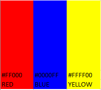

### 2. Typography 

The following font cabin have been selected to ensure the text is easy to read, add value to the text, and invoke user to perceive a positive emotion from the text. 

## 3. Imagery 
I have selected popular Paw Patrol characters for the images on the cards to resonate with users and ensure all images are consistent across the game.
Please refer to further details in credits section for specific images used within the project

### [Contents table ](#home)
---
# Features  

## Current Features (short term objectives): 

### Home page
The site consists of one page.  The Page is divided into a header with the title of the game, logo and number of moves/ pairs matched.

Under the header is the main game area displaying 12 cards faced down.

### New game modal 

On load, the new game modal pop up will be displayed with Paw Patrol logo  and two clickable buttons .
-	1. “Play New Game” button  - when the user clicks the button, the user will be able to begin the memory game.  All moves, matched card counters will be set to zero.  
-	2. “Rules” button– when the user clicks the button, the rules modal pop up will appear, which will allow the user to read the rules of the game.  

### Rules modal
The rules modal  is accessed from the new game modal once the user clicks on the “rules” button.  The user can read the rules of the game and click close [x] to bring them back to the new game modal.

### The game
Once the user initiates the game by clicking “Play New Game” from the new game modal, the user will be presented with the memory game. 3 rows of 4 cards ,totalling 12 cards to choose from which will have a ‘back card’ image displayed on each of the cards as default.

The user can click only on 2 cards at a time. 

The user will start the game, by selecting two cards. The number of moves will update and increment by 1.

If the user matches two cards they will remain up turned and display the front of the card – Paw Patrol character. The matched pairs pop up modal will display as user feedback. The matched pairs counter will increment by 1

When all 6 pairs are successfully chosen, the finish game modal popup will appear
The user can restart the game at any point by clicking the “New game” button.  A confirmation modal will appear to confirm whether they wish to continue game or start a new game.

### Confirmation Modal
The confirmation modal  is accessed from the memory main game page, once the user clicks “New Game”.  The user can decide whether to click on “New Game” which will go to the new game modal or they can click on “continue”  to carry on with the current game. 

### Finish game Modal
When all 6 pairs are successfully chosen, a modal pop up  will appear with 
* the Score
* number of moves

Score calculated by the follow formula

 if moves are

=< 9 - points = 80,

=< 12 - points = 60,

=< 14 - points = 40, 

=< 16 - points = 30,

=< 18 - points = 20, 

=< 20 - points = 10,

=> 21 - points = 5

The user will then enter their name for the score board  and click save.  This will then display the score board.  

### Score Board Modal
Displays score board with the usernames and score in numerical order (top/highest score at top)

The user can then click on the close [x] and decide whether they would like to play again or click on the scoreboard to view from the main game page

---
## Features remaining to implement (long term objectives): 

1.) Add in skill levels with timer

2.) Add additional game type e.g. logos, animals etc

3.) Background, winning the game and matching cards sounds

### [Contents table ](#home)

---
# Testing  

## Features testing  

 I checked all the features described above to ensure they worked and included screen shots below

## &#x2611; New game modal 
On load, the new game modal pop up will be displayed with Paw Patrol logo  and two clickable buttons .
-	1. “Play New Game” button  - when the user clicks the button, the user will be able to begin the memory game.  All moves, matched card counters will be set to zero.  
-	2. “Rules” button– when the user clicks the button, the rules modal pop up will appear, which will allow the user to read the rules of the game.

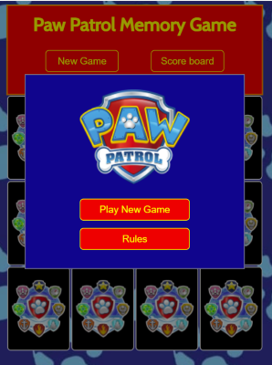

## &#x2611;  Rules modal
The rules modal  is accessed from the new game modal once the user clicks on the “rules” button.  The user can read the rules of the game and click close [x] to bring them back to the new game modal.

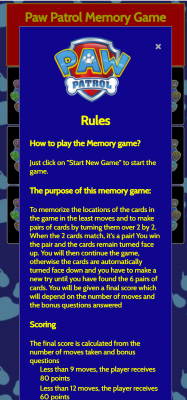

## &#x2611; The game

Once the user initiates the game by clicking “Play New Game” from the new game modal, the user will be presented with the memory game. 3 rows of 4 cards ,totalling 12 cards to choose from which will have a ‘back card’ image displayed on each of the cards as default.

The user can click only on 2 cards at a time. 

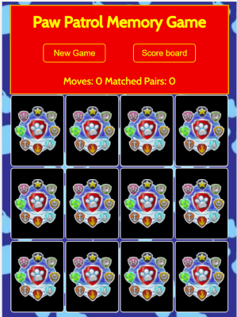

The user will start the game, by selecting two cards. The number of moves will update and increment by 1.

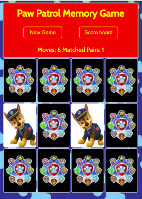

If the user matches two cards they will remain up turned and display the front of the card – Paw Patrol character. The matched pairs pop up modal will display as user feedback. The matched pairs counter will increment by 1

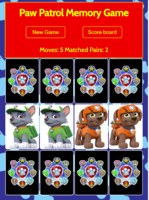

When all 6 pairs are successfully chosen, the finish game modal popup will appear

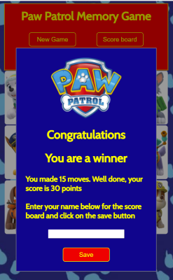

The user can restart the game at any point by clicking the “New game” button.  A confirmation modal will appear to confirm whether they wish to continue game or start a new game. 

## &#x2611;  Confirmation Modal
The confirmation modal  is accessed from the memory main game page, once the user clicks “New Game”.  The user can decide whether to click on “New Game” which will go to the new game modal or they can click on “continue”  to carry on with the current game. 

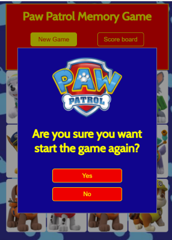

## &#x2611;  Finish game Modal
When all 6 pairs are successfully chosen, a modal pop up  will appear with 
* the Score
* number of moves

Score calculated by the follow formula

 if moves are

=< 9 - points = 80,

=< 12 - points = 60,

=< 14 - points = 40, 

=< 16 - points = 30,

=< 18 - points = 20, 

=< 20 - points = 10,

=> 21 - points = 5

The user will then enter their name for the score board  and click save.  This will then display the score board.  

## &#x2611; Score Board Modal
Displays score board with the usernames and score in numerical order (top/highest score at top)

The user can then click on the close [x] and decide whether they would like to play again or click on the scoreboard to view from the main game page

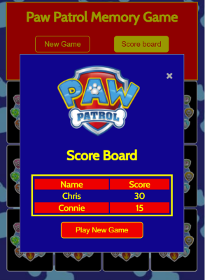

or click on the close [x] to close the modal  which will display the last game

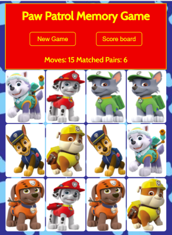

### [Contents table ](#home)
---
## User stories testing  

I have tested the site owner/user stories to ensure the MPV has been achieved.

Site Owner Goals:
* I want to provide a fun game for children online users between the ages of 4 - 7 years old

    * Achieved by popular brand, simplicity and styling which resonates/appeals to all users in the target audience of 4-7 year olds. 
* I want users to navigate through the game with ease and for the game to be intuitive

    * The simplicity of using one page with clear instructions via pop-up modals to aid navigation ensures the game is easy to use. The score pop-up modals provide feedback required.

* I want users to be incentivised to return and replay the game to beat their previous scores listed on the scoreboard

     * The score board is arranged with highest/top score at the top, allowing/incentivising the users to come back, revisit and replay the game.

* I want users to have facility to return and replay the game with different games each time.
     * The cards are shuffled so each new game has random positioning of cards to challenge users.

* I want the game to be accessible to all users
    * Site has been tested for contrast between background and foreground colours to cater for the visually impaired and has alt text for non-text elements.

### Site User Goals:
* As a user, I want to play an online game
    * Online memory game to challenge user with competitive score board created.

* As a user who has never played the game before, I need to locate the rules and understand how to play the game.
    * The simplicity of using one page with clear instructions via pop-up modals to aid navigation ensures the game is easy to use. Navigation to the rules via the ‘new game’ pop-up modal provides comprehensive instructions on how to play the game. 

* As a user, I need to know how the scoring works
    * The comprehensive score explanation is detailed in the ‘rules’ pop-up modal.
* As a user, I want to know when I have match two cards
    * The ‘match-cards’ modal, displayed for 1.5 seconds, provides feedback when two cards have been matched. Both cards are then displayed for game remainder. 

* As a user, I want to know when I have finished the game and see my score
    * The ‘finish game’ pop-up modal provides feedback when the user has finished the game, detailing how many moves, the final score and requests user to enter their name and save to update score board data.

* As a user, I want to be able to restart the game at any point
    * The user can start new game at any point by easily navigating the ‘new game’ button on the header.

* As a user of multiple devices, I need a website that is fully responsive, invoking the same user experience across all devices, in particular my mobile. 
    * The game has been tested and is functional on all devices with no compromised features/views.

* As a user, I want to know how many matched cards and moves I have made during the game at any time
    * User can see how many matched cards and moves during the game at any time in the header

* As a user, I want to be challenged with different games each time I play
    * Each new game has a new alternative selection of card locations.

* As a user, I expect the site to be fully accessible
    * Site has been tested for contrast between background and foreground colours to cater for the visually impaired and has alt text for non-text elements.

### [Contents table ](#home)
---
## Constructive User Feedback 

I received the following constructive feedback from friends and family, predominantly made up of the target audience, 4-7 year olds and implemented corrective action:

* On the ‘Finish Game’ pop-up modal, the three button options provided to proceed with (‘New Game’ / ‘View Score Board’ / ‘Save users name’) are confusing. 
The goal is to encourage the user to save their name in order to update the score board and incentivise replay. There is no need for these options at this point.
     * Corrective action: Remove buttons and centre the ‘input text’ field and ‘save button’

* On the scoreboard, in order to commence a new game, the user has to press ‘close’ then click on the ‘new game’ button in the header, the ‘confirmation’ pop-up modal then promps user to ‘start new game’ and then to click ‘yes’. 
    
    (My 4 year old daughter is very frustrated by the amount of steps required to start new game. The process is not intuitive or easy to understand.)
    * Corrective action: Added a ‘new game’ button on the ‘score’ board pop-up model, which in turn, closes the ‘score’ board pop-up modal and starts a new game, reducing steps.

* On matching a pair of cards, there is no real feedback apart from the matched cards remanding upturned. 
    * Corrective action: Add a pop-up modal to congratulate the user
### [Contents table ](#home)
---
## Known issues during testing 

* During testing an issue was identified on the score table.
When the user entered their name, the score board would display with the scores array initially.  When the user finished the game again.  The array would display after the previous displayed table, therefore duplicating the names and scoring
    * Corrective Action: Reset the con variable in the reset function

* During testing an issue was identified on the finish game modal
The users name was still displayed in the text input field from the previous game.
    * Corrective action: Reset winnerName value to Null when the reset board function is called

* During testing an issue was identified on the main game.  The user could click on a 3rd / 4th card after clicking the 1st/2nd on the same turn.
On investigation I noticed a spelling mistake on the boardDisable variable which stopped boardDisable resulting true and would stop the user from clicking a further card.
    * Corrective action:  Corrected spelling 

* During testing an issue was identified on the scoreboard. If the user didn't enter a name on the finish game modal, there would be no name on the scoreboard with a score
    * Corrective action:  I put an if statement in savedetails function. If the value equal empty string then alert the user to enter their name else run the rest of the function
### [Contents table ](#home)
---
## W3C HTML Validator Test   
I used [W3C HTML Validator](https://validator.w3.org/) code checking tool to validate the html code.

* I selected the "Validate by URI" option for each page index.html

## The page came up with the following warning:
Empty heading. From line 151, column 13; to line 151, column 29 <h3 id="results"></h3> 
This is ok as it will be populated from JS

No Errors on report

---
## W3 CSS Validator Test    
I used [W3C CSS Validator](https://jigsaw.w3.org/css-validator/) code checking tool to validate the css code.
* I opened and selected the "Validate by direct input" option and pasted in the code.

No Errors on report

---
## A11y Color Contrast Acccessibility Validation 
I used [A11y Color Contrast Acccessibility Validation](https://color.a11y.com/) 
This website provides free color contrast analysis tools that will display the color contrast issues of a web page; per WCAG 2.1 Guidelines. Color Contrast refers to how bright or dark colors appear against each other on screens; particularly with regard to the relative, gray-scale luminosity as perceived by the human eye.

When it comes to website accessibility, the contrast between the text and the text background is a concern for colorblind and other visually impaired users.

This color contrast tool enables users to comply with website accessibilities regulations.

### Testing

Website colour palette was tested for contrast accessibility validation and passed with no issues

---
## JSHint Validation Service 
I used [JSHint Validation](https://jshint.com/) to test the JavaScript code.

No errors were detected in the code. Warnings were detected in the code however this was due to the use of the new ES6 syntax in the code.

### [Contents table ](#home)
---

## Chrome Dev Tools Lighthouse 

## Desktop report

Initial Score performance 99, accessibility 97, best practices 87, seo 90

### Best practice
* Issue

Displays images with incorrect aspect ratio

Source:  backgroundimg.png:1

Description: Failed to load resource: the server responded with a status of 404 ()

The image had the incorrect file name, corrected with backgroundimg.png

* Corrective action: 

Resized all the images to the expected size and rerun the report and best practises scored 100

### SEO 
* Issue

Document does not have a meta description

* Corrective action

Add meta tags and increased the score Seo to 100

*** I ran the report again after implementing corrective actions. The site received 86 for performance and 85 for accessibility

### Performance 

* Issue

Image elements do not have explicit width and height on paw patrol logo

* Corrective action

Width and height on paw patrol logo

* Issue

Properly size images

rocky  697.kb

zuma 251kb

* Corrective action

Reduce file size

rocky  697.kb to 84.9

zuma 251kb to 29.8kb

***  Performance score improved to 93

### Accessibility

* Issue 

[user-scalable="no"] is used in the <meta name="viewport"> element or the [maximum-scale] attribute is less than 5.

* Corrective action:

Remove the user-scalable="no" parameter from the viewport meta tag and set the maximum-scale parameter to 6

*** Accessibility score improved to 97
### [Contents table ](#home)

## Mobile report
Initial Score performance 75, accessibility 97, best practices 87, seo 100

### Performance
* Issue
Resources are blocking the first paint of your page. Consider delivering critical JS/CSS inline and deferring all non-critical JS/styles

Serve images that are appropriately-sized to save cellular data and improve load time
rubble.png resource size 303 kb potential saving 222kb
backgroundcard.jpg resource size 243 kb potential saving 215kb

* Correcive action: tried to resolve it by using google-webfonts-helper inline CSS, but the score for the best practices reduced. 
Reduced file size of images
*** score improved to 80

### Best Practices
* Issue
Displays images with incorrect aspect ratio
patrol patrol logo displayed size 150x130 expected size 300 x 260
corrective action: resized image to 300x260
*** Improved score to 93

---
# Design Responsiveness Testing  

## Simulated Testing 
For each section on each page, I tested various screen sizes in the development environment. Using the Google Developer tools I tested the responsiveness throughout the development process and all tests passed.

## Tested with Chrome DevTools using profiles for with screen sizes:

* Moto G4

* Galaxy S5

* Pixel 2

* Pixel 2 XL

* iPhone 5 SE

* iPhone 6/7/8

* iPhone 6/7/8 Plus

* iPhone 

* iPad

* iPad Pro

## Desktop testing

### Browsers:

 * Chrome

* Firefox

## Mobile testing:

* Iphone 10

---
##  Unfixed Bugs  

No Bugs left to fix

### [Contents table ](#home)
---
# Deployment  
This is the process i took to deploy my project to the hosting platform GitHub
1.	Open Github page up in browser
2.	Log in using your username and password
3.	Select "ccarabine/memory-game" from repositories displayed on left-hand side of screen
4.	Click "settings” displayed in the navigation toolbar menu
5.	Click “Pages” on the left hand side navigation menu
6.	Select "Master Branch" in the dropdown under the Source heading
7.	Finally, click “save”

 The live link can be found here <a href="https://ccarabine.github.io/memory-game/">Paw Patrol Memory Game</a>

---
# Technologies Used   

For this project the main languages used are __Javascript__, __HTML5__ and __CSS3__.

I have also utilised the following frameworks  and tools:

* [GitPod](https://www.gitpod.io/):  I used GitPod as the IDE for this project and Git has been used for Version Control.
* [GitHub](https://www.github.com/): GitHub has been used to create a repository to host the project and receive updated commits from GitPod.
* [Balsamiq](https://balsamiq.com/): I used Balsamiq to create the wireframe for the website for the basic structure and layout.
* [Google Fonts](https://getbootstrap.com/): I have used Google Fonts to import fonts for styling purposes for this project.
* [Chrome Dev Tools](https://developers.google.com/web/tools/chrome-devtools): Chrome Dev Tools was used to test the site and assist with debugging issues.
* [W3C Markup Validation Service](https://validator.w3.org/): The W3C Markup Validation Service was used to validate the HTML document for this project and to identify any issues with the code.
* [W3C CSS Validation Service](https://jigsaw.w3.org/css-validator/): The W3C CSS Validation Service was used to validate the CSS document for this project and to identify any issues with the code.
* [Am I Responsive](http://ami.responsivedesign.is/): Am I Responsive was used to create the header image for the README file.
* [Resize Pixel](https://www.img2go.com/compress-image): Img2go was used to reduce the size of the paw patrol images.
* [A11y Colour Contrast checker](https://color.a11y.com/Contrast/):A11y Colour Contrast checker was used to check the colour contrast between background and text colours.
* [Fav Icon Generator](https://favicon.io/favicon-generator/): i used Fav Icon generator to create my fav Icon from text.

### [Contents table ](#home)
---
# Credits 

## Media
Images were downloaded from :

Paw Patrol characters and background images https://www.pngkey.com/pngs/paw-patrol/ 

Paw Patrol Logo https://www.pngegg.com/en/png-bddzo 

## Code
I used the following websites and videos for inspiration and code for my project

Data attributes
https://developer.mozilla.org/en-US/docs/Learn/HTML/Howto/Use_data_attributes

How to create modals https://www.w3schools.com/howto/howto_css_modals.asp

Adding to arrays https://www.youtube.com/watch?v=NxVCq4p0Kb0

Score boards
https://www.chegg.com/homework-help/questions-and-answers/exercise-ll-work-array-ll-add-nodes-dom-display-results-scores-run-application-see-user-in-q24972694

Memory game tutorial https://www.youtube.com/watch?v=ZniVgo8U7ek
i used following tutorial on YouTube. I have used code from this tutorial to assist with creating the memory game. Please note some of the code has been customised by myself to fit this project. I have also added my own code for additional functions for the project.

### [Contents table ](#home)
---
# Acknowledgements 
A big thank you to my mentor Maria for her help and guidance throughout my first project

Thank you to to the following:
* My daughter Connie who inspired me, provided really critical feedback and displayed much pleasure on discovering and playing the game.
* My wife for her help and constructive feedback throughout the project. 
* The tutors for help and support.

***