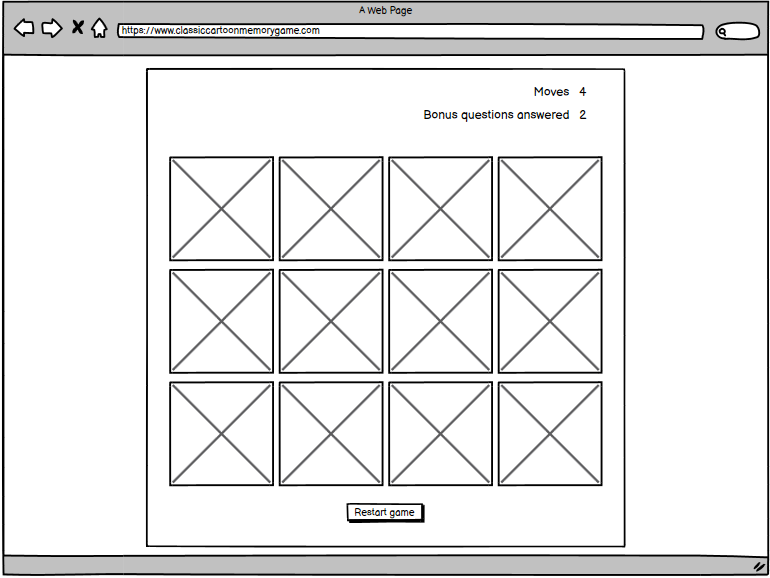
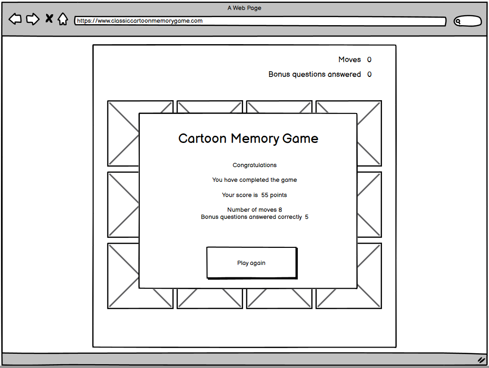

***

# Project Overview

## Introduction
The website has been created for users to enjoy a fun Paw Patrol memory game.

The owners core goals for the website are:

* to  provide a fun game for children between the ages of 4 - 8 years old
* for users to return to play the game and try to beat their score
* for users to navigate through the site with ease and be intuitive

## Link to memory game live site <a href="   "> Memory Game </a>

insert link to responsive image 

Image from  <a href="http://ami.responsivedesign.is/">Am I Responsive</a>, to display the websites home page across mobile, tablet and desktop.

***
# Table of Contents 

1. [User Experience (UX)](#ux)
    * [Strategy](#strategy)
        * [Project Objectives & Goals](#goals)
        * [User Stories](#userstories)
        * [Strategy Tradeoffs](#tradeoffs)
    * [Scope](#scope)
    * [Skeleton](#skeleton)
        * [Wireframes](#wireframes)
    * [Surface](#design)
        * [Colours](#colours)
        * [Typography](#typography)
        * [Imagery](#imagery)

2. [Features](#features)
    * [Current Features](#features-current)
    * [Features to implement](#features-toimplement)

3. [Testing](#testing)
    * [User Stories Testing](#user-feedback)
    * [Testing Check List ](#testing-check-list) 
    * [Validation Testing -HTML ](#validation-testing-html)
    * [Validation Testing -CSS ](#validation-testing-css)
    * [Validation Testing -A11y Color Contrast Accessibility](#validation-testing-A11y)
    * [Design Responsiveness Testing](#testing-responsiveness)
        * [Simulated Testing](#testing-simulated)
4. [Deployment](#deployment)
5. [Technologies Used](#technology-used)
6. [Credits](#credits)

7. [Acknowledgements](#acknowledgements)

# User Experience (UX)  [Contents](#home)

## User Stories: 
* As a user, I want to play an online game
* As a user, I want to read the rules and understand how to play the game
* As a user, I want to be able to know how the scoring works
* As a user, I want to be able to know when I have matched two cards
* As a user, I want to know when I have finished the game and see my score
* As a user, I want to be able to restart the game at any point
* As a user of multiple devices, I need a website that is fully responsive, invoking the same user experience across all devices, in particular my mobile. 

## Strategy Tradeoffs 
The purpose of this memory game is for users of all ages to have fun playing the game
 
to update
 

to update -I have rated the features on a scale of 1 to 5 in terms of importance (how important is it for the project now) and feasibility (how realistic is that we can implement a solution)

## 2. Scope 

To achieve the strategy goals, I want to implement the following functional specification and content requirement:

* A home page which will allow users to start the memory game and  view the rules
* The memory game, which users can access when the game has started, the user will be able to see the 12 turned over cards 
* User feedback to let them know they have selected two matching cards
* Number of moves tracker
* Number of correct bonus questions answered correctly
* A end of game feature that will let the user know they have finished the game, display their score

---

# 3. Structure  [Contents](#home)
link to be updated in menu
The site will be on one page, there is no need for a navbar or footer due to the site being simple.
The main page, there will be a background image, with a main playing area that will house the playing cards, scores and buttons

---
# 4. Skelton  [Contents](#home)

## Wireframe 

I used <a href="https://balsamiq.com/">Balsamiq</a> to create wireframes for my project in order to plan out the layout of the interface, navigation and information design of the webpage on  desktop, tablets and mobile devices.

## Wireframes for Home Page. 
### Desktop

### Tablet

### Mobile

## Wireframes for The Memory Game 
### Desktop

### Tablet

### Mobile

## Wireframes for Completed Memory Game 
### Desktop

### Tablet

### Mobile

# 4. Surface  [Contents](#home)

## Visual Design

## 1. Colour Palette:  

to update

## 2. Typography 

The following font cabin have been selected to ensure the text is easy to read, add value to the text, and invoke user to perceive a positive emotion from the text. 

## 3. Imagery 

I used images from the Paw Patrol tv series to ensure all images were related

Please refer to further details in credits section for specific images used within the project

---
# Features  [Contents](#home)

## Current Features (short term objectives): 

## New game modal

A modal pop up will be displayed with a main heading and have two clickable buttons .
-	1. “Start game” button  - when the user clicks on the button, the user would be able to begin the memory game.  All moves, final score and bonus questioned answered will be set to zero.
-	all cards will show the back face
-	2. “Rules” button– when the user clicks on button, a modal pop up will appear which will allow the user to read the rules of the game.

## Rules Modal
The rules modal  is accessed from the new game modal once the user clicks on the “rules” button.  The user can read the rules of the game and click close to bring them back to the new game modal.

## The game
Once the user initiates the game by clicking “play” from the new game modal, the user will be presented with the memory game. 3 rows of 4 cards ,totaling 12 cards to choose from which will have a backcard image displayed on each of the cards as default.
The user can click only on 2 cards at a time. 

If they match two cards they will remain up turned and display the front of the card – cartoon characters.

A bonus question modal popup  will appear and ask the user to answer the name of the cartoon character from a choice of 3.  If they answer correctly they get extra points, if they get the answer incorrect they continue on with the game.

The number of moves will update and increment by 1 when a user has selected 2 cards

The bonus question will increment by 1 when the user has selected the correct answer

When all 6 pairs are successfully chosen, the finish game modal popup will appear

The user can restart the game at any point by clicking the “restart game” button.  A confirmation modal will appear to confirm there choice whether to continue game or start a new game.

## Confirmation Modal
The confirmation modal  is accessed from the memory game page, once the user clicks “restart”.  The user can decide wether to click on “restart” which will goto the new game modal or they can click on “continue”  to carry on with the current game 

## Finish game Modal
When all 6 pairs are successfully chosen, a modal pop up  will appear with 
* the Score
* number of moves
* number of bonus questions calculated

Score calculated by the follow formula
 if moves are

=< 9 - points = 80,

=< 12 - points = 60,

=< 14 - points = 40, 

=< 16 - points = 30, 

=< 18 - points = 20, 

=< 20 - points = 10, 

=> 21 - points = 5

The user will be given the option to click “play again” button to restart the game.

---
# Features remaining to implement (long term objectives): 

1.) Add in skill levels with timer

2.) Add additional game type e.g. logos, animals etc

---
# Testing  [Contents](#home)

## User Feedback 

I received the following constructive feedback from friends and family and implemented corrective action:

---
# My testing Check list  [Contents](#home)

## I Checked all the following features to ensure they worked

## Main Structure -Header, navigation bar and footer featured on all four pages. 
&#x2611;    Consistency/aesthetically pleasing 

---
# W3C HTML Validator Test   
I used [W3C HTML Validator](https://validator.w3.org/) code checking tool to validate the html code.

* I selected the "Validate by URI" option for each page index.html, thebarn.html, thearea.html and contactus.html separately.

## Pages initally came up with the following errors:

---
# W3 CSS Validator Test    
I used [W3C CSS Validator](https://jigsaw.w3.org/css-validator/) code checking tool to validate the css code.
* I opened and selected the "Validate by direct input" option and pasted in the code.

## Pages initally came up with the following errors:

---
# A11y Color Contrast Acccessibility Validation 
This website provides free color contrast analysis tools that will display the color contrast issues of a web page; per WCAG 2.1 Guidelines. Color Contrast refers to how bright or dark colors appear against each other on screens; particularly with regard to the relative, gray-scale luminosity as perceived by the human eye.

When it comes to website accessibility, the contrast between the text and the text background is a concern for colorblind and other visually impaired users.

This color contrast tool enables users to comply with website accessibilities regulations.

## Testing

Website colour palette was tested for contrast accessibility validation and failed, cololour contrast issues were found:

---
# Design Responsiveness Testing  [Contents](#home)

## Simulated Testing 
For each section on each page, I tested various screen sizes in the development environment. Using the Google Developer tools I tested the responsiveness throughout the development process and all tests passed.

## Tested with Chrome DevTools using profiles for with screen sizes:

* Moto G4

* Galaxy S5

* Pixel 2

* Pixel 2 XL

* iPhone 5 SE

* iPhone 6/7/8

* iPhone 6/7/8 Plus

* iPhone 

* iPad

* iPad Pro

## Desktop testing

### Browsers:

 * Chrome

* Firefox

## Mobile testing:

* Iphone 10

# Unfixed Bugs

---
# Deployment  [Contents](#home)
This is the process i took to deploy my project to the hosting platform GitHub
1.	Open Github page up in browser
2.	Log in using your username and password
3.	Select "ccarabine/Churchbarn-holiday-let" from repositories displayed on left-hand side of screen
4.	Click "settings” displayed in the navigation toolbar menu
5.	Click “Pages” on the left hand side navigation menu
6.	Select "Master Branch" in the dropdown under the Source heading
7.	Finally, click “save”

 to update  The live link can be found here <a href="https://ccarabine.github.io/Churchbarn-holiday-let/">Church-Barn-Holiday-Let</a>

---
# Technologies Used   

For this project the main languages used are __HTML5__ and __CSS3__.

I have also utilised the following frameworks  and tools:

* [GitPod](https://www.gitpod.io/):  I used GitPod as the IDE for this project and Git has been used for Version Control.
* [GitHub](https://www.github.com/): GitHub has been used to create a repository to host the project and receive updated commits from GitPod.
* [Balsamiq](https://balsamiq.com/): I used Balsamiq to create the wireframe for the website for the basic structure and layout.
* [Google Fonts](https://getbootstrap.com/): I have used Google Fonts to import fonts for styling purposes for this project.
* [Font Awesome](https://fontawesome.com/): Font Awesome was used to apply icons in the Footer and the area sections.
* [Chrome Dev Tools](https://developers.google.com/web/tools/chrome-devtools): Chrome Dev Tools was used to test the site and assist with debugging issues.
* [W3C Markup Validation Service](https://validator.w3.org/): The W3C Markup Validation Service was used to validate the HTML document for this project and to identify any issues with the code.
* [W3C CSS Validation Service](https://jigsaw.w3.org/css-validator/): The W3C CSS Validation Service was used to validate the CSS document for this project and to identify any issues with the code.
* [Am I Responsive](http://ami.responsivedesign.is/): Am I Responsive was used to create the header image for the README file.
* [Resize Pixel](https://www.resizepixel.com/download): Resize Pixel was used to reduce the size of my wireframe images for the README file.
* [A11y Colour Contrast checker](https://color.a11y.com/Contrast/):A11y Colour Contrast checker was used to check the colour contrast between background and text colours.
* [Fav Icon Generator](https://favicon.io/favicon-generator/): i used Fav Icon generator to create my fav Icon from text.

---
# Credits 

## Media
 Images were downloaded from 
https://www.pastemagazine.com/tv/the-50-best-cartoon-characters-of-all-time/
background images from https://stock.adobe.com/uk/ 

## Code
I used the following websites and videos for inspiration and code for my project

Data attributes
https://developer.mozilla.org/en-US/docs/Learn/HTML/Howto/Use_data_attributes

Grid [grid](https://css-tricks.com/snippets/css/complete-guide-grid/)

Flexbox [Flex](https://css-tricks.com/snippets/css/a-guide-to-flexbox/)

## Acknowledgements 
A big thank you to my mentor Maria for her help and guidance throughout my first project

Thank you to to the following:
* My wife for her help and constructive feedback throughout the project. 
* My father-in-law, owner of church barn in supplying some of the images and copy.
* The tutors for help and support.

***